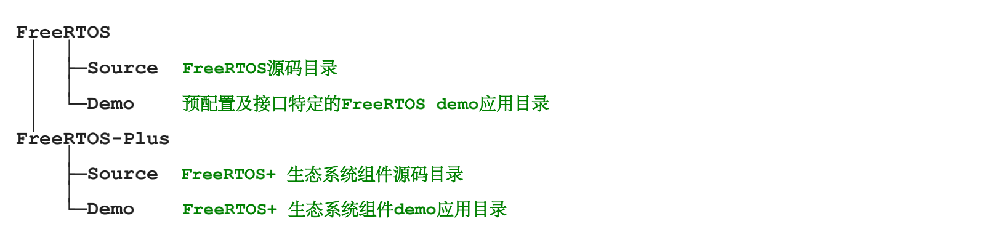

# FreeRTOS发行版

## 1.1 简介与范围

FreeRTOS作为一个单独的压缩文档进行分发，其中包含了FreeRTOS的所有正式接口，以及大量的预配置的demo。

### 范围

本章通过介绍以下几点，来帮助用户定位自己使用FreeRTOS的文件和目录：

- 提供一个FreeRTOS的顶级目录结构视图。
- 介绍在一个特定的FreeRTOS工程里哪些文件是必须的。
- 介绍几个示例程序。
- 提供如何创建一个新工程的信息。

这些介绍只涉及官方的FreeRTOS发行版。这些附带的例子使用了略微不同的组织方式。

## 1.2 理解FreeRTOS发行版

### FreeRTOS接口定义

FreeRTOS能被大约20种编译器构建，能够运行在30多种处理器架构上。每种支持的编译器与处理器组合都被定义为一个单独的FreeRTOS接口。

### 构建FreeRTOS

FreeRTOS可以看做为一个库，它提供了多任务处理能力，否则它就是一个裸机应用。
FreeRTOS作为一组C源文件提供，有些源文件为所有接口通用，有些则是针对特定的接口。将这些源文件作为你的工程的一部分来构建，即可在你的应用中使用FreeRTOS API。为了降低门槛，每个官方的FreeRTOS接口都提供了一个demo应用。这些demo应用已经进行了预配置，以构建正确的源文件及包含正确的头文件。

demo应用的构建应"开箱即用"，但是有些demo比其他demo更老，有些演示会因构建工具的修改而产生问题。1.3节介绍了demo应用。

### FreeRTOSConfig.h

FreeRTOS由一个FreeRTOSConfig.h的头文件配置。例如：FreeRTOSConfig.h包含常量configUSE_PERRMPTION，此设置定义了系统使用合作式还是抢占式调度算法。因为FreeRTOSConfig.h包含了应用程序的特殊定义，所以它应该置于应用目录，而不应该置于FreeRTOS源码目录。

所有FreeRTOS的接口都提供了一个demo应用，所有的demo应用都包含了FreeRTOSConfig.h文件。没有必要从头开始创建FreeRTOSConfig.h文件，而是应该从demo应用中提供的FreeRTOSConfig.h开始并进行调整修改。

### 官方FreeRTOS发行版

FreeRTOS作为一个单独的zip文件进行分发。这个zip文件包含了所有FreeRTOS接口的源码、项目文件及所有FreeRTOS demo应用。它也包含了精选的FreeRTOS+ 生态系统组件，以及精选的FreeRTOS+ 生态系统demo应用。

不要因FreeRTOS海量的源文件而劝退，每个应用仅需要少量的FreeRTOS文件，不要全部包含。

### FreeRTOS发行版的顶级目录

FreeRTOS的一级及二级目录结构展示于图一。

**图1：FreeRTOS发行版的顶级目录**

本zip文件包含了FreeRTOS源文件的副本；所有的FreeRTOS demo项目以及FreeRTOS+ demo项目，都会在FreeRTOS/Source中查找FreeRTOS源码，如果目录结构被修改，那么项目可能无法正常构建。

## 所有接口的共同FreeRTOS源文件

FreeRTOS的核心源码在仅仅两个C文件中，它在所有FreeRTOS接口中通用。这两个C文件分别是`task.c`与`list.c`，它们直接位于FreeRTOS/Source目录中，见图2。除了这两个文件之外，以下源文件也位于同一目录。

- queue.c

queue.c 提供了队列与信号服务，它将会在之后具体描述。queue.c几乎总会被使用到。

- timer.c

