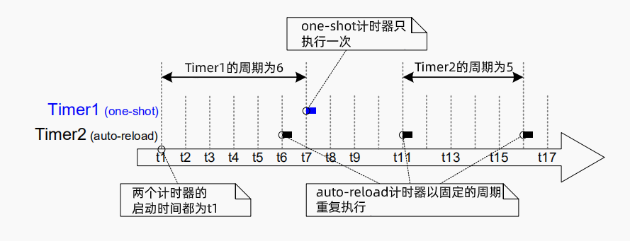
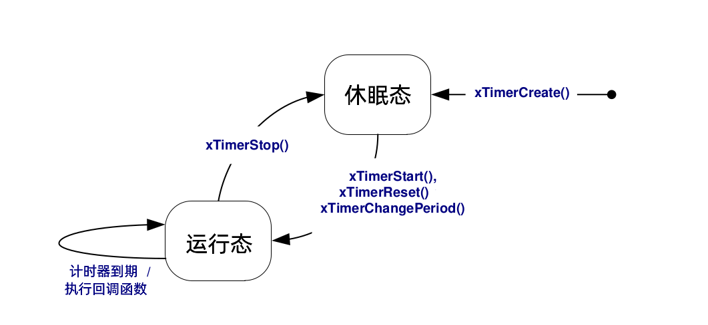
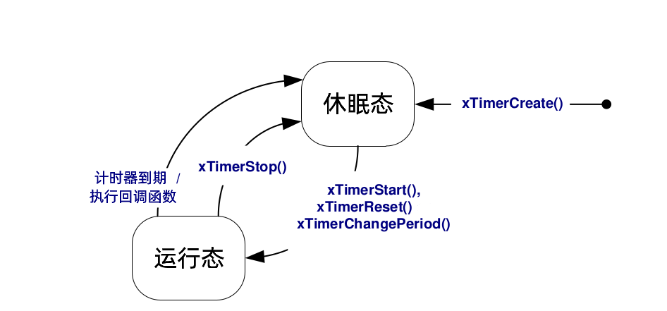
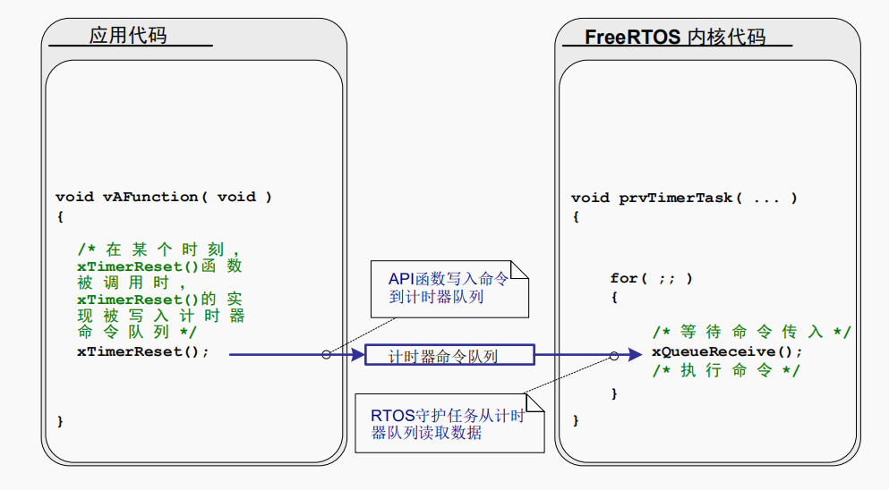

# 软件计时器管理

## 5.1 简介与范围

软件计时器被用来在"未来的一段时间"或"周期性以固定的频率"调度函数执行。由软件计时器执行的函数被称为软件计时器回调函数。

软件计时器被FreeRTOS内核实现，且由FreeRTOS内核控制，它不需要硬件支持，也与硬件计时器或硬件计数器无关。

```note
根据FreeRTOS使用创新的设计来确保最大效率的理念，除了软件计时器回调函数正在执行的时间外，软件计时器不占用任何处理时间。
```

软件计时器功能是可选的，可以通过以下操作来让你的工程包含它：

1. 让你的工程包含FreeRTOS源文件`FreeRTOS/Source/time.c`
2. 在`FreeRTOSConfig.h`中将`configUSE_TIMERS`设为`1`

### 范围

本章旨在让读者理解：

- 软件计时器相对于任务的特性
- RTOS守护任务
- 计时器命令队列
- 一次性软件计时器与周期性软件计时器的区别
- 怎样去创建、启动、重置、修改软件计时器的周期

## 5.2 软件计时器回调函数

软件计时器回调函数被实现为C函数，它的唯一特别之处为它的函数原型，它必须返回`void`，并将软件计时器句柄作为唯一参数。清单72展示了软件定时器的回调函数原型。


```note
函数清单72：软件定时器回调函数原型

***void ATimerCallback(TimerHandle_t xTimer);***
```

软件计时器回调函数会从函数开头执行到函数结尾，并以正常方式退出。函数应该很快结束，绝对不能进入阻塞状态。

```danger

如我们所见，软件计时器回调函数在FreeRTOS调度器启动时自动创建，在任务的上下文中执行。因此，软件计时器回调函数绝对不能调用能够使任务进入阻塞状态的FreeRTOS API函数。
可以调用类似`xQueueReceive()`的函数，但函数的`xTickToWait`参数(指定函数的阻塞时间)值必须设置为零。
不可以调用类似`vTaskDelay()`的函数，因为调用`vTaskDelay()`总会使任务进入阻塞状态。

```

## 5.3 软件计时器的属性和状态

### 软件计时器周期

一个软件计时器的“周期(period)”，指的是从软件计时器启动，到回调函数被调用之间的时间间隔。

### one-shot计时器与auto-reload计时器

这是两种类型的计时器：

1. one-shot计时器
   one-shot计时器一旦启动，它的回调函数仅会执行一次。one-shot计时器能够被手动重启，但它不能自己重启自己。
2. auto-reload计时器
   auto-reload计时器一旦启动，它每次到了预定的时间后会就重新启动，从而定期执行回调函数。
   
图38展示了one-shot计时器和auto-reload计时器行为的不同，垂直的虚线代表每次滴答中断发生的时间。



**图38： one-shot计时器和auto-reload计时器行为区别**

参见图38：

- Timer1

Timer1是一个one-shot计时器，它的周期为6个滴答中断，它在t1时刻启动，所以它的回调函数会在6个滴答中断，也就是t7时刻执行。因为Timer1是一个one-shot计时器，所以它的回调函数不会被再次执行。

- Timer2

Timer2是一个auto-reload计时器，它的周期为5个抵达中断，它在t1时刻启动，所以它的回调函数会每隔5个滴答中断执行一次，在图38中，这个时刻为t6,t11与t16。

### 软件计时器状态

一个软件计时器可以为下列两种状态之一：

- 休眠态(Dormant)

存在处于休眠状态的软件计时器，可以通过它的句柄被引用，但因为没有运行，所以它的回调函数将不会执行。

- 运行态(Running)

一个处于运行状态的软件计时器，从它**进入运行状态**或**最后一次重置软件计时器**开始，当经过了它的周期时间后，就会执行它的回调函数。

图39和图40分别展示了one-shot计时器和auto-reload计时器，在休眠态和运行态之间可能发生转换的情况。区别两个流程图的关键是，在计时器过期后进入的状态。auto-reload计时器执行它的回调函数然后重新进入运行态，one-shot计时器则执行回调函数之后进入休眠态。

`xTimerDelete`API函数会删除计时器。计时器无论处于什么状态都可以被删除。

{:height="70%" width="70%"}

**图39： auto-reload软件计时器状态与切换**

{:height="65%" width="65%"}

**图40： ont-shot软件计时器状态与切换**

## 5.4 软件计时器上下文

### RTOS守护(计时器服务)任务

所有的软件计时器回调函数，都在同一个RTOS守护(或称为计时器服务)任务的上下文中执行。

```note
该任务以前被叫做软件计时器服务任务(timer service task)，因为它最初只被用来执行软件计时器回调函数。现在同样的任务有了其他的作用，所以现在以更通用的"RTOS守护任务(RTOS daemon task)"命名。
```

这个守护服务是一个标准FreeRTOS任务，它在调度器启动时自动创建。它的优先级和栈大小分别由编译期常量`configTIMER_TASK_PRIORITY`与`config_TIMER_STACK_DEPTH`控制。
两个常量都被定义在`FreeRTOSConfig.h`中。

在软件计时器回调函数中，一定不能调用能够使任务进入阻塞态的FreeRTOS API函数，因为这样会使守护任务进入阻塞状态。

### 计时器命令队列

软件计时器API函数将“命令”从“调用该API的任务”发送至“守护任务”的“计时器命令队列”。它展示于图41。前面说的“命令”包括启动一个计时器、停止一个计时器、重置一个计时器。

计时器命令队列是一个标准FreeRTOS队列，它在调度器启动时自动创建。它的队列长度由编译期常量`configTIMER_QUEUE_LENGTH`设置，该常量定义在`FreeRTOSConfig.h`中。

{:height="70%" width="70%"}

**软件计时器API函数使用计时器命令队列与RTOS守护任务通信**