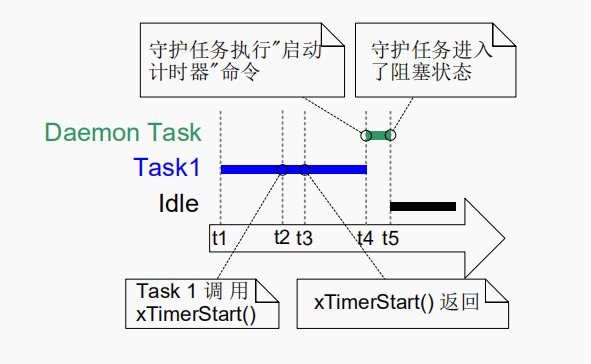
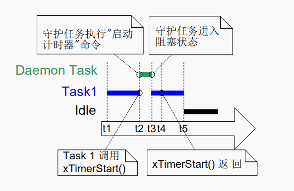
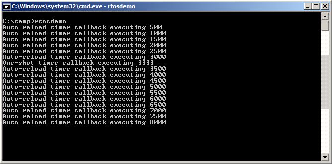
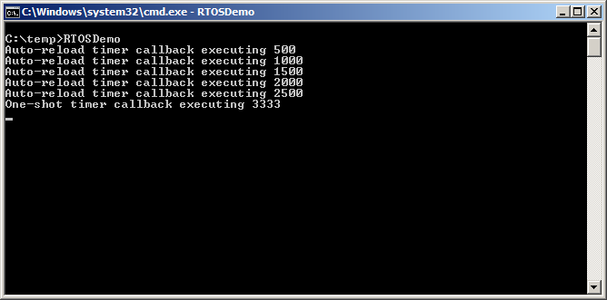
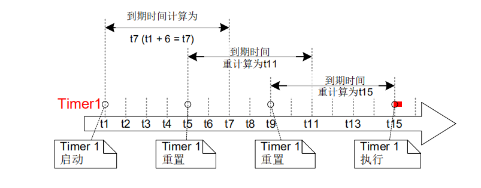
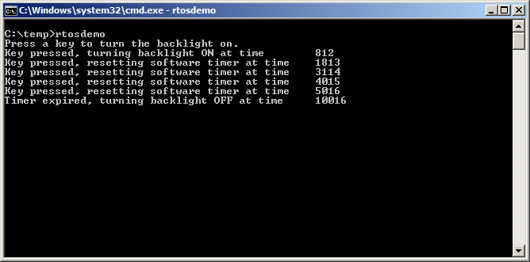

# 软件计时器管理

## 5.1 简介与范围

软件计时器被用来在"未来的一段时间"或"周期性以固定的频率"调度函数执行。由软件计时器执行的函数被称为软件计时器回调函数。

软件计时器被FreeRTOS内核实现，且由FreeRTOS内核控制，它不需要硬件支持，也与硬件计时器或硬件计数器无关。

```note
根据FreeRTOS使用创新的设计来确保最大效率的理念，除了软件计时器回调函数正在执行的时间外，软件计时器不占用任何处理时间。
```

软件计时器功能是可选的，可以通过以下操作来让你的工程包含它：

1. 让你的工程包含FreeRTOS源文件`FreeRTOS/Source/time.c`
2. 在`FreeRTOSConfig.h`中将`configUSE_TIMERS`设为1

### 范围

本章旨在让读者理解：

- 软件计时器相对于任务 的特性
- RTOS守护任务
- 计时器命令队列
- 一次性软件计时器与周期性软件计时器的区别
- 怎样去创建、启动、重置、修改软件计时器的周期

## 5.2 软件计时器回调函数

软件计时器回调函数被实现为C函数，它的唯一特别之处为它的函数原型，它必须返回`void`，并将软件计时器句柄作为唯一参数。清单72展示了软件定时器的回调函数原型。


```note
函数清单72：软件定时器回调函数原型

***void ATimerCallback(TimerHandle_t xTimer);***
```

软件计时器回调函数会从函数开头执行到函数结尾，并以正常方式退出。函数应该很快结束，绝对不能进入阻塞状态。

```danger

如我们所见，软件计时器回调函数在FreeRTOS调度器启动时自动创建，在任务的上下文中执行。因此，软件计时器回调函数绝对不能调用能够使任务进入阻塞状态的FreeRTOS API函数。
可以调用类似xQueueReceive()的函数，但函数的xTickToWait()参数(指定函数的阻塞时间)值必须设置为零。
不可以调用类似vTaskDelay()的函数，因为调用vTaskDelay()总会使任务进入阻塞状态。

```

## 5.3 软件计时器的属性和状态

### 软件计时器周期

一个软件计时器的“周期(period)”，指的是从软件计时器启动，到回调函数被调用之间的时间间隔。

### one-shot计时器与auto-reload计时器

这是两种类型的计时器：

1. one-shot计时器
   one-shot计时器一旦启动，它的回调函数仅会执行一次。one-shot计时器能够被手动重启，但它不能自己重启自己。
2. auto-reload计时器
   auto-reload计时器一旦启动，它每次到了预定的时间后会就重新启动，从而定期执行回调函数。
   

图38展示了one-shot计时器和auto-reload计时器行为的不同，垂直的虚线代表每次滴答中断发生的时间。


**图38： one-shot计时器和auto-reload计时器行为区别**

参见图38：

- Timer1

Timer1是一个one-shot计时器，它的周期为6个滴答中断，它在t1时刻启动，所以它的回调函数会在6个滴答中断，也就是t7时刻执行。因为Timer1是一个one-shot计时器，所以它的回调函数不会被再次执行。

- Timer2

Timer2是一个auto-reload计时器，它的周期为5个抵达中断，它在t1时刻启动，所以它的回调函数会每隔5个滴答中断执行一次，在图38中，这个时刻为t6,t11与t16。

### 软件计时器状态

一个软件计时器可以为下列两种状态之一：

- 休眠态(Dormant)

存在处于休眠状态的软件计时器，可以通过它的句柄被引用，但因为没有运行，所以它的回调函数将不会执行。

- 运行态(Running)

一个处于运行状态的软件计时器，从它**进入运行状态**或**最后一次重置软件计时器**开始，当经过了它的周期时间后，就会执行它的回调函数。

图39和图40分别展示了one-shot计时器和auto-reload计时器，在休眠态和运行态之间可能发生转换的情况。区别两个流程图的关键是，在计时器过期后进入的状态。auto-reload计时器执行它的回调函数然后重新进入运行态，one-shot计时器则执行回调函数之后进入休眠态。

xTimerDelete()API函数会删除计时器。计时器无论处于什么状态都可以被删除。

{:height="70%" width="70%"}

**图39： auto-reload软件计时器状态与切换**

{:height="65%" width="65%"}

**图40： one-shot软件计时器状态与切换**

## 5.4 软件计时器上下文

### RTOS守护(计时器服务)任务

所有的软件计时器回调函数，都在同一个RTOS守护(或称为计时器服务)任务的上下文中执行。

```note
该任务以前被叫做软件计时器服务任务(timer service task)，因为它最初只被用来执行软件计时器回调函数。现在同样的任务有了其他的作用，所以现在以更通用的"RTOS守护任务(RTOS daemon task)"命名。
```

这个守护服务是一个标准FreeRTOS任务，它在调度器启动时自动创建。它的优先级和栈大小分别由编译期常量`configTIMER_TASK_PRIORITY`与`config_TIMER_STACK_DEPTH`控制。
两个常量都被定义在`FreeRTOSConfig.h`中。

在软件计时器回调函数中，一定不能调用能够使任务进入阻塞态的FreeRTOS API函数，因为这样会使守护任务进入阻塞状态。

### 计时器命令队列

软件计时器API函数将“命令”从“调用该API的任务”发送至“守护任务”的“计时器命令队列”。它展示于图41。前面说的“命令”包括启动一个计时器、停止一个计时器、重置一个计时器。

计时器命令队列是一个标准FreeRTOS队列，它在调度器启动时自动创建。它的队列长度由编译期常量`configTIMER_QUEUE_LENGTH`设置，该常量定义在`FreeRTOSConfig.h`中。

{:height="70%" width="70%"}

**图41： 软件计时器API函数使用计时器命令队列与RTOS守护任务通信**

### 守护任务调度

守护任务调度类似于其他的FreeRTOS任务调度，如果它在可执行任务中拥有最高优先级，那么它仅会执行任务，或者执行计时器回调函数。图42与图43演示了`configTIMER_TASK_PRIORITY`如何影响执行模式。

图42展示了守护任务优先级低于调用xTimerStart()API函数任务的优先级时的执行模式。



**图42： 守护任务优先级低于调用xTimerStart()API函数任务的优先级时的执行模式**

参见图42，Task1的优先级要高于守护任务，守护任务的优先级要高于空闲任务。

1. t1时刻
   
   Task1在运行态，守护任务在阻塞态。
   
   守护任务将会在有命令进入命令队列时退出阻塞状态，执行命令，而如果软件计时器到期了，则将会执行软件计时器回调函数。

2. t2时刻
   
   Task1调用xTimerStart()。
   
   xTimerStart()发送命令到计时器命令队列，造成守护任务退出阻塞态。但因为Task1的优先级高于守护任务，所以守护任务不会抢占Task1。
   
   Task1一直处于运行态，而守护任务从阻塞态进入了准备态。

3. t3时刻
   
   Task1执行完成了xTimerStart()API函数。Task1从xTimerStart()函数的开头执行到函数的结尾，没有离开运行态。

4. t4时刻
   
   Task1调用了某个API函数导致自身进入了阻塞态，此时守护认为称为准备态中优先级最高优先级的任务，所以调度器会使守护任务进入运行态。之后守护任务会开始执行Task1发送到命令队列的命令。

```note
软件计时器时间是从发送"启动一个计时器"到命令队列开始计算，而不是从命令队列收到"启动一个计时器"命令开始计算。
```
5. t5时刻
   
   守护任务执行完成了Task1发送的命令，然后尝试从命令队列中获取更多数据，但是命令队列此时为空，所以守护任务会重新进入阻塞态。之后守护任务仍会因为计时器命令队列传入命令，或计时器到期重新进入准备态。
   
   此时空闲任务成为准备态任务中最高优先级的任务，所以调度器会使空闲任务进入运行态。

图43展示了类似于图42的情况，唯一的区别是调用xTimerStart()的任务优先级低于守护任务。



**图43： 调用xTimerStart()API函数任务的优先级低于守护任务优先级时的执行模式**

参见图43，守护任务的优先级高于Task1优先级，Task1优先级高于idle任务优先级。

1. t1时刻
   
   如上，Task1在运行态，守护任务在阻塞态。
   
2. t2时刻
   
   Task1调用了xTimerStart()。
   
   xTimerStart()发送了一个命令到计时器命令队列，使得守护任务退出阻塞态。由于守护任务的优先级高于Task1，所以调度器会选择守护任务进入运行态。
   
   Task1在执行xTimerStart()后被守护任务抢占，所以现在进入了准备态。
   
   守护任务执行Task1发送到计时器命令队列中的命令。

3. t3时刻
   
   守护任务将来自Task1的命令执行完毕，然后尝试从命令队列中获取更多数据，但是命令队列此时为空，所以守护任务会重新进入阻塞态。
   
   此时Task1成为准备态任务中最高优先级的任务，所以调度器会使Task1进入运行态。

4. t4时刻
   
   Task1在执行完毕xTimerStart()函数之间就被守护任务抢占，所以在Task1重新进入重新运行态时从被抢占处返回。

5. t5时刻
   
   Task1调用了某个API函数进入了阻塞态，此时空闲任务成为准备态任务中最高优先级的任务，所以调度器会使空闲任务进入运行态。 

在图42的场景中展示了：Task1发送一个命令到计时器命令队列与守护任务接收与处理任务的时间间隔。
在图43的场景中展示了：在Task1从发送命令的函数返回之前，守护任务接收与处理来自Task1的命令。

命令发送至计时器命令队列会带一个时间戳。这个时间戳被用来记录从应用任务发送命令，到被守护任务处理所经过的时间。
例如，发送"启动一个周期为10滴答的计时器"的命令，时间戳会用来确保发送命令后的10滴答执行回调，而不是被守护任务处理该命令后的10滴答执行回调。

## 5.5 创建和启动软件计时器

### xTimerCreate()API函数

```warning

FreeRTOS v9.0.0也包含了xTimerCreateStatic()函数，它会在编译期静态分配内存。

```

软件计时器必须在其被使用前显式创建。

软件计时器被TimerHandle_t类型的变量引用。xTimerCreate()用于创建软件计时器，然后返回一个引用了软件计时器创建的TimerHandle_t。软件计时器被创建为休眠态。

第0章介绍了数据类型的命名约定。

```note

函数清单73：xTimerCreate()API函数原型

***TimerHandle_t xTimerCreate( const char * const pcTimerName,
							TickType_t xTimerPeriodInTicks,
							UBaseType_t uxAutoReload,
 							void * pvTimerID,
 							TimerCallbackFunction_t pxCallbackFunction );***

```

**表格27：xTimerCreate()参数与返回值**

|  参数/返回值    |  介绍    |
| ---- | ---- |
|  pcTimerName    |  它应是计时器的介绍，不会被RTOS以任何形式使用。他的作用仅仅是方便调试。用名字标识计时器要比句柄标识方便    |
| xTimerPeriodInTicks | 计时器指定的滴答周期，`pdMS_TO_TICKS`宏可以将毫秒转化为滴答计数 |
| uxAutoReload | 设置该参数为pdTRUE时创建的auto-reload计时器，设置pdFALSE会创建one-shot计时器 |
| pvTimerID | 每个计时器都会有一个ID，这个ID是一个void指针，可以被应用开发者用于某些目的，这个ID在多个软件计时器使用不只一个回调函数时会特别有用。本章将会演示如何使用一个计时器ID |
| pxCallbackFunction  | 软件计时器回调函数是一个简单的C函数，函数原型见函数清单73。pxCallbackFunction是一个函数指针(实际上是一个函数名)，它是软件计时器的回调函数。 |
| 返回值 | 如果返回为NULL，意味着软件计时器因为堆内存不足，FreeRTOS为软件计时器分配必要的数据结构，所有软件计时器无法被创建。如果返回值不为NULL，那么意味着软件计时器创建成功，且会返回软件计时器的句柄。第二章有内存管理的详细信息。 |

### xTimerStart()API函数

xTimerStart()被用来使软件计时器从休眠态进入或重新进入运行态。xTimerStop()被用来停止在运行态的软件计时器。停止软件计时器相当于让软件计时器进入休眠态。

xTimerStart()能够在调度器启动之前调用，但在调度器启动之前，软件计时器不会真正的启动。

```warning

永远不要在中断服务例程里调用xTimerStart()，而应该调用中断安全的实现版本xTimerStartFromISR()。
```

```note

函数清单74： xTimerStart()API函数原型

***BaseType_t xTimerStart( TimerHandle_t xTimer, TickType_t xTicksToWait );***
```

**表格28：xTimerStart()参数与返回值**

| 参数/返回值| 介绍|
|---|---|
| xTimer| 要启动或重启的软件计时器句柄，它是在执行xTimerCreate()成功创建软件计时器时返回的句柄。 |
| xTicksToWait | xTimerStart()发送一个“启动一个计时器”命令到守护任务的软件计时器队列，xTicksToWait定义了在命令队列已满时，任务的最大等待时间。<br>xTimerStart()如果为0，则在命令队列已满时会立即返回。<br>阻塞时间定义为滴答周期，所以绝对时间取决于滴答频率。`pdMS_TO_TICKS`宏可以将毫秒转化为滴答时间。<br>如果在`FreeRTOSConfig.h`中将`INCLUDE_vTaskSuspend`设为1,则当命令队列已满时，任务将会无限期(没有超时时间)等待，直到命令队列有空闲空间。如果xTimerStart()在调度器启动前调用，那么xTicksToWait参数将会被忽略，效果相当于将xTimerToWait设为0 |
| 返回值| 可能会有两个可能的值：<br>1.pdPASS<br>pdPASS将会返回"启动一个计时器"命令是否被成功发送到了计时器队列。<br>如果守护任务优先级高于调用xTimerStart()任务的优先级，那么调度器会确保在xTimerStart()返回之前启动命令。这是因为守护任务将会在计时器有数据后，马上抢占调用xTimerStart()的任务。<br>如果定义了阻塞时间(xTicksToWait不为0)，那么调用该函数的任务可能进入阻塞态，来等待命令队列中有空闲空间，但是在阻塞时间到期之前，数据已经成功的被写入了命令队列。<br>2.pdFALSE<br>pdFALSE将在计时器队列已满时，"启动一个计时器"命令没有成功写入队列而返回。<br>如果定义了阻塞时间(xTicksToWait不为0)，调用该函数的任务将会进入阻塞态来等待守护任务在计时器队列腾出空间，但是指定的阻塞时间在有空间之前就过期了。|

### 例13： 创建one-shot计时器与auto-reload计时器

清单75展示了如何创建和启动一个one-shot计时器与auto-reload计时器。

```c
/* 赋值为one-shot计时器与auto-reload计时器的周期分别为3.333s与0.5s。 */
#define mainONE_SHOT_TIMER_PERIOD pdMS_TO_TICKS( 3333 )
#define mainAUTO_RELOAD_TIMER_PERIOD pdMS_TO_TICKS( 500 )
int main( void )
{
TimerHandle_t xAutoReloadTimer, xOneShotTimer;
BaseType_t xTimer1Started, xTimer2Started;

    /* 创建one-shot计时器, 保存创建的计时器句柄到xOneShotTimer。 */
    xOneShotTimer = xTimerCreate(
                    /* 软件计时器的名字，它是文本类型，不会被FreeRTOS使用. */
                    "OneShot",
                    /* 软件计时器的滴答周期。 */
                    mainONE_SHOT_TIMER_PERIOD,
                    /* 设置uxAutoReload为pdFALSE来创建one-shot计时器。 */
                    pdFALSE,
                    /* 本例不会用到计时器ID。 */
                    0,
                    /* 创建的计时器使用的回调函数。 */
                    prvOneShotTimerCallback );
    /* 创建one-shot计时器, 保存创建的计时器句柄到xAutoReloadTimer。 */
    xAutoReloadTimer = xTimerCreate(
                    /* 软件计时器的名字，它是文本类型，不会被FreeRTOS使用。 */
                    "AutoReload",
                    /* 软件计时器的滴答周期。 */   
                    mainAUTO_RELOAD_TIMER_PERIOD,
                    /* 设置uxAutoReload为pdTRUE来创建auto-reload计时器。 */
                    pdTRUE,
                    /* 本例不会用到计时器ID。 */
                    0,
                    /* 创建的计时器使用的回调函数. */
                    prvAutoReloadTimerCallback );
    /* 检查软件计时器是否被创建. */
    if( ( xOneShotTimer != NULL ) && ( xAutoReloadTimer != NULL ) )
    {
        /* 启动软件计时器，阻塞时间设为0，此时调度器还没有被启动，
        所以这里指定的阻塞时间无论如何都会会被忽略。 */
        xTimer1Started = xTimerStart( xOneShotTimer, 0 );
        xTimer2Started = xTimerStart( xAutoReloadTimer, 0 );
    }

    /* 实现xTimerStart()启动计时器命令队列，xTimerStart()将会在软件计时器已满时失败。
     守护任务在调度器启动之前不会启动，所以所有命令将会在调度器启动之前在命令队列暂留。
     同时检查两个调用是否通过。 */
    if( ( xTimer1Started == pdPASS ) && ( xTimer2Started == pdPASS ) )
    {
        /* 启动调度器。 */
        vTaskStartScheduler();
    }
    /* 正常情况下，影院不会执行到这里。 */
    for( ;; );
}

```
**示例清单75： 创建和启动一个在例13使用的计时器**

每次在计时器回调函数被调用时只是打印一条消息。one-shot计时器回调函数的实现展示在清单76，auto-reload计时器回调函数展示在清单77。

```c
static void prvOneShotTimerCallback( TimerHandle_t xTimer )
{
TickType_t xTimeNow;
    /* 获取当前的滴答计数。 */
    xTimeNow = xTaskGetTickCount();
    /* 输出在哪一时刻执行了哪一个回调函数。 */
    vPrintStringAndNumber( "One-shot timer callback executing", xTimeNow );
    /* 文件范围变量。 */
    ulCallCount++;
}
```

**示例清单76： 例13使用的one-shot计时器回调函数**

```c
static void prvAutoReloadTimerCallback( TimerHandle_t xTimer )
{
TickType_t xTimeNow;
    /* 获取当前的滴答计数。 */
    xTimeNow = uxTaskGetTickCount();
    /* 输出在哪一时刻执行了哪一个回调函数。 */
    vPrintStringAndNumber( "Auto-reload timer callback executing", xTimeNow );
    ulCallCount++;
}
```

**示例清单77： 例13使用的auto-reload计时器回调函数**

本例的执行结果展示在图44，图44展示了auto-reload计时器回调函数以500滴答中断为固定周期，one-shot计时器回调函数只在滴答计数在3333是执行一次。



**图44： 例13的输出结果**

## 5.6 计时器ID

每个软件计时器都有一个ID，它是一个标记值，可以被应用编写者使用。这个ID保存在一个void指针里，所以能够直接保存整型值，指向任何其他对象，或者用作函数指针。

在软件计时器创建时，ID会被赋予初值，它的值可以通过vTimerSetTimerID()API函数进行修改。可以通过pvTimerGetTimerID()API函数进行查询。

不像其他的软件计时器API函数，vTimerSetTimerID()和pvTimerGetTimerID()会直接获取软件计时器，而不是通过发送命令到软件计时器。

```note

vTimerSetTimerID函数原型

***void vTimerSetTimerID( const TimerHandle_t xTimer, void *pvNewID );***
```

**函数清单78：vTimerSetTimerID()函数原型**

**表格29：vTimerSetTimerID()参数**
|参数/返回值 | 介绍 |
|---|---|
| xTimer| 将要更新ID值的软件计时器的句柄。它是在执行xTimerCreate()成功创建软件计时器时返回的句柄 |
|pvNewID |这是赋予软件计时器新ID值 |

### pvTimerGetTimerID()API函数

```note

pvTimerGetTimerID函数原型
***void *pvTimerGetTimerID( TimerHandle_t xTimer );***
```
**函数清单79： pvTimerGetTimerID()函数原型**

**表格30：pvTimerGetTimerID()参数与返回值**
|参数/返回值 | 介绍 |
| xTimer| 将要更新ID值的软件计时器的句柄。它是在执行xTimerCreate()成功创建软件计时器时返回的句柄 |
|pvNewID | 设置后的ID新值|

### 例14： 在软件计时器中使用回调函数参数

同一个计时器回调函数可以赋给多个软件计时器，当回调函数执行时，计时器回调函数参数可以用于分辨是哪个软件计时器到期了。

例13分别使用了两个函数；一个回调函数使用的是one-shot计时器，一个用的是auto-reload计时器。例14创建了与例13类似的功能，但两个计时器用的是同一个计时器回调函数。

```c

    /* 创建one-shot计时器, 保存创建的计时器句柄到xOneShotTimer。 */
    xOneShotTimer = xTimerCreate(
                    /* 软件计时器的名字，它是文本类型，不会被FreeRTOS使用. */
                    "OneShot",
                    /* 软件计时器的滴答周期。 */
                    mainONE_SHOT_TIMER_PERIOD,
                    /* 设置uxAutoReload为pdFALSE来创建one-shot计时器。 */
                    pdFALSE,
                    /* 本例不会用到计时器ID。 */
                    0,
                    /* 两个计时器都用的是prvTimerCallback()。 */
                    prvTimerCallback );
    /* 创建one-shot计时器, 保存创建的计时器句柄到xAutoReloadTimer。 */
    xAutoReloadTimer = xTimerCreate(
                    /* 软件计时器的名字，它是文本类型，不会被FreeRTOS使用。 */
                    "AutoReload",
                    /* 软件计时器的滴答周期。 */   
                    mainAUTO_RELOAD_TIMER_PERIOD,
                    /* 设置uxAutoReload为pdTRUE来创建auto-reload计时器。 */
                    pdTRUE,
                    /* 本例不会用到计时器ID。 */
                    0,
                    /* 两个计时器都用的是prvTimerCallback()。 */
                    prvTimerCallback );
```

**代码清单80: 为例14创建计时器**

prvTimerCallback()会在两个计时器中的任何一个到期时执行。prvTimerCallback()会使用函数的参数来判断到底是one-shot计时器到期，还是auto-reload计时器到期。

prvTimerCallback()也展示了怎样使用软件计时器ID作为计时器特定存储；每个软件计时器维持一个数值，用来记录自身计时器ID到期的次数，auto-reload计时器会在该值为5时让自己停止。

prvTimerCallback()展示在清单79。
```c
static void prvTimerCallback( TimerHandle_t xTimer )
{
    TickType_t xTimeNow;
    uint32_t ulExecutionCount;
    /* 软件计时器过期的次数储存在计时器的ID中。获取ID值，并加1，
     然后将这个新值保存到计时器ID中，因为ID是一个void指针，所以
     被转换为uint32_t类型。 */
    ulExecutionCount = ( uint32_t ) pvTimerGetTimerID( xTimer );
    ulExecutionCount++;
    vTimerSetTimerID( xTimer, ( void * ) ulExecutionCount );
    /* 获取当前的滴答计数。 */
    xTimeNow = xTaskGetTickCount();
    /* 在计时器创建时，one-shot计时器的句柄被保存在xOneShotTimer。
     通过比较句柄判断当前到期的计时器时one-shot计时器还是auto-reload
     计时器，只后会打印一条信息来展示是哪个计时器的回调函数被执行。*/
    if( xTimer == xOneShotTimer )
    {
        vPrintStringAndNumber( "One-shot timer callback executing", xTimeNow );
    }
    else
    {
        /* xTimer不等于xOneShotTimer, 所以auto-reload计时器到期了。 */
        vPrintStringAndNumber( "Auto-reload timer callback executing", xTimeNow );
        if( ulExecutionCount == 5 )
        {
            /* 在auto-reload执行五次之后让自己停止。因为计时器回调函数在守护服务区中执行，
             所以不能调用能使任务进入阻塞态的API函数。因此设置阻塞时间为0。 */
        xTimerStop( xTimer, 0 );
        }
    }
}
```

**代码清单81： 例14使用的软件计时器**

例14的输出结果在图45中展示，可以看到在auto-reload计时器仅执行了五次。



**图45： 例14执行输出结果**

## 改变计时器的周期

每个正式的FreeRTOS接口都提供了一个或多个示例程序。大多数示例程序都是自检，并使用一个LED提供一个视觉的反馈，来展示程序的运行状态。如果自检成功，那么LED就会缓慢切换，如果失败，那么就会快速切换。

有些示例程序在任务中执行自检，使用vTaskDelay()函数来控制LED的切换频率。而有些程序则是在软件计时器中执行自检，通过控制计时器周期来控制LED的切换频率。

### xTimerChangePeriod()API函数

软件计时器的周期通过xTimerChangePeriod()函数改变。

如果用xTimerChangePeriod()改变一个已经运行的计时器，那么这个计时器将会用新的周期值来计算它的到期时间。重新计算的到期时间是相对于如果调用xTimerChangePeriod()时，而不是相对于最初启动计时器的计算的。

如果xTimerChangePeriod改变一个处于休眠态的计时器(计时器没有在运行)，计时器将会重新计算到期时间，并使计时器进入运行态。

```warning

永远不要在中断服务例程中调用xTimerChangePeriod(),而应该使用中断安全的版本xTimerChangePeriodFromISR()代替。

```

```note
函数清单82： xTimerChangePeriod()函数原型

***BaseType_t xTimerChangePeriod( TimerHandle_t xTimer, 
 TickType_t xNewTimerPeriodInTicks,
 TickType_t xTicksToWait );***

```

**表格31： xTimerChangePeriod()的参数和返回值**

|参数/返回值 | 介绍| 
|---|---|
| xTimer| 将要更新ID值的软件计时器的句柄。它是在执行xTimerCreate()成功创建软件计时器时返回的句柄 |
|xTimerPeriodInTicks| 软件计时器新的周期，它定义为滴答。`pdMS_TO_TICKS`宏可以将毫秒转化为滴答时间。|
|xTicksToWait | xTimerChangePeriod()会发送"修改周期"命令到守护服务的计时器命令队列。xTicksToWait定义了在命令队列已满时，任务的最大等待时间。<br>xTimerStart()如果为0，则在命令队列已满时会立即返回。<br>阻塞时间定义为滴答周期，所以绝对时间取决于滴答频率。`pdMS_TO_TICKS`宏可以将毫秒转化为滴答时间。<br>如果在`FreeRTOSConfig.h`中将`INCLUDE_vTaskSuspend`设为1,则当命令队列已满时，任务将会无限期(没有超时时间)等待，直到命令队列有空闲空间。如果xTimerStart()在调度器启动前调用，那么xTicksToWait参数将会被忽略，效果相当于将xTimerToWait设为0 |
| 返回值| 可能会有两个可能的值：<br>1.pdPASS<br>pdPASS将会返回"修改周期"命令是否被成功发送到了计时器队列。<br>如果定义了阻塞时间(xTicksToWait不为0)，那么调用该函数的任务可能进入阻塞态，来等待命令队列中有空闲空间，但是在阻塞时间到期之前，数据已经成功的被写入了命令队列。<br>2.pdFALSE<br>pdFALSE将在计时器队列已满时，"修改周期"命令没有成功写入队列而返回。<br>如果定义了阻塞时间(xTicksToWait不为0)，调用该函数的任务将会进入阻塞态来等待守护任务在计时器队列腾出空间，但是指定的阻塞时间在有空间之前就过期了。|

清单83展示了FreeRTOS例子自检程序在软件计时器回调函数中，发生错误时，如何使用xTimerChangePeriod()增加LED的切换频率。执行自检的软件计时器被称为"检查计时器(check timer)"。

```c
/* 检查计时器的周期为3000ms，所以LED会的切换频率为3s。如果自检程序检测到意外状态，
 软件计时器的周期会变为2s，造成LED切换频率加快。 */
const TickType_t xHealthyTimerPeriod = pdMS_TO_TICKS( 3000 );
const TickType_t xErrorTimerPeriod = pdMS_TO_TICKS( 200 );
/* 被检查计时器调用的回调函数 */
static void prvCheckTimerCallbackFunction( TimerHandle_t xTimer )
{
static BaseType_t xErrorDetected = pdFALSE;
 
    if( xErrorDetected == pdFALSE )
    {
        /* 暂时没有出现错误。再次执行自检程序。此函数会要求被创建的示例程序上报自己的状态。
         同时检查全部任务是否仍在运行(能够上报自己的状态)。 */
        if( CheckTasksAreRunningWithoutError() == pdFAIL )
        {
            /* 一个或多个任务上报了异常状态。可能发生了错误。降低检查计时器周期，
             以增加本函数的执行频率，同时增加LED的切换频率。因为本函数在守护任务
             的上下文中执行，所以将阻塞时间设为0来确保任务不会使任务进入阻塞态。 */
            xTimerChangePeriod( xTimer, /* 将要被更新的计时器。 */
                                xErrorTimerPeriod, /* 计时器的新周期。 */
                                0 ); /* 在发送命令时不能进入阻塞态。 */
        }
        /* 检测到错误。 */
        xErrorDetected = pdTRUE;
 }
    /* 切换LED，LED的切换频率取决于本函数的调用频率，它由检查计时器的周期决定。
     如果CheckTasksAreRunningWithoutError()增返回pdFAIL，检查计时器的
     周期就会从3000ms降为200ms。 */
    ToggleLED();
}
```

**代码清单83： 使用xTimerChangePeriod()**

## 重置软件计时器

重置(reset)软件计时器意味着重启(re-start)计时器。计时器到期时间将相对于重置时间，而不是计时器启动时间重新计算。在图46展示了一个周期为6的计时器在最终到期与执行其回调函数之前，重置两次。



**图46： 启动与重置一个周期为6的软件计时器**

参见图46：

- Timer1在t1时刻启动，它的周期为6，它会在t7时刻，也就是在执行时刻的六个滴答后执行它的回调函数。
- Timer1在t7时刻之前重置，此时计时器还未到期，回调函数也未执行。Timer1在t5时刻重置，所以它的到期时间重计算为t11，也就是重置时刻的6个滴答之后。
- Timer1在t11时刻之前再次重置，此时计时器还未到期，回调函数也未执行。Timer1在t9时刻重置，所以它的到期时间重计算为t15，也就是重置时刻的6个滴答之后。
- Timer1没有再次被重置，所以在t15时刻它的回调函数相应执行。

### xTimerReset()API函数

计时器使用xTimerReset()重置。

xTimerReset()也可以启动一个休眠态的计时器。

```warning
永远不要在中断服务例程中调用xTimerReset(),而应该使用中断安全的版本xTimerResetFromISR()代替。

```
```note
函数清单84： xTimerReset()API函数原型
***BaseType_t xTimerReset( TimerHandle_t xTimer, TickType_t xTicksToWait );***
```

**表格32： xTimerReset()参数与返回值**

|参数/返回值 | 介绍|
|---|---|
| xTimer| 将要更新ID值的软件计时器的句柄。它是在执行xTimerCreate()成功创建软件计时器时返回的句柄 |
|xTicksToWait | xTimerChangePeriod()会发送"修改周期"命令到守护服务的计时器命令队列。xTicksToWait定义了在命令队列已满时，任务的最大等待时间。<br>xTimerStart()如果为0，则在命令队列已满时会立即返回。<br>阻塞时间定义为滴答周期，所以绝对时间取决于滴答频率。`pdMS_TO_TICKS`宏可以将毫秒转化为滴答时间。<br>如果在`FreeRTOSConfig.h`中将`INCLUDE_vTaskSuspend`设为1,则当命令队列已满时，任务将会无限期(没有超时时间)等待，直到命令队列有空闲空间。如果xTimerStart()在调度器启动前调用，那么xTicksToWait参数将会被忽略，效果相当于将xTimerToWait设为0 |
| 返回值| 可能会有两个可能的值：<br>1.pdPASS<br>pdPASS将会返回"重置"命令是否被成功发送到了计时器队列。<br>如果定义了阻塞时间(xTicksToWait不为0)，那么调用该函数的任务可能进入阻塞态，来等待命令队列中有空闲空间，但是在阻塞时间到期之前，数据已经成功的被写入了命令队列。<br>2.pdFALSE<br>pdFALSE将在计时器队列已满时，"重置"命令没有成功写入队列而返回。<br>如果定义了阻塞时间(xTicksToWait不为0)，调用该函数的任务将会进入阻塞态来等待守护任务在计时器队列腾出空间，但是指定的阻塞时间在有空间之前就过期了。|

### 例15： 重置软件计时器

此例模仿手机的背光行为。背光：
- 当一个按键被按下时打开背光。
- 在一定时间内按下一个键则背光会保持。
- 如果超过时间没有任何键按下则屏幕自动关闭。

使用one-shot软件计时器实现这个行为：

- 这个模拟的背光在一个键按下时启动，在软件计时器回调函数中关闭。
- 软件计时器会在每次按键按下时重置。
- 因此，必须在软件计时器到期之前按下按键，来阻止背光关闭，这段时间设为计时器周期。如果软件计时器在到期之前没有任何键按下，软件计时器的回调函数会执行，从而背光关闭。

xSimulatedBacklightOn参数保存背光状态，xSimulatedBacklightOn为pdTRUE代表背光开启，pdFALSE代表背光关闭。

软件计时器回调函数战士在清单85：

```c
static void prvBacklightTimerCallback( TimerHandle_t xTimer )
{
TickType_t xTimeNow = xTaskGetTickCount();
     /* 软件计时器到期，关闭背光。 */
    xSimulatedBacklightOn = pdFALSE;
    /* 打印背光关闭的时间。 */
    vPrintStringAndNumber( 
                        "Timer expired, turning backlight OFF at time\t\t", xTimeNow );
}
```

例15创建一个任务轮询键盘(见warning)，本任务展示在清单86，但因下方描述的问题，清单86的程序并不代表一个最佳设计。

```warning
轮询键盘：

打印到Windows控制台，读取Windows控制台键盘输入都会造成Windows系统调用。Windows系统调用包括使用Windows控制台、硬盘、TCP/IP栈，都会对FreeRTOS Windows接口造成不利影响，通常应该避免这种设计。
```


FreeRTOS允许你的应用被事件驱动。事件驱动设计可以非常有效率的处理时间，因为可以仅在事件发生时处理时间，不用浪费时间轮询事件是否已经发生。例15不能被设计为事件驱动，因为当使用FreeRTOS Windows接口时，键盘中断处理不可用，所以选择效率低的轮询技术代替。如果清单86是中断服务例程，那么应该使用xTimerResetFromISR()代替xTimerReset()。

```c
static void vKeyHitTask(void *pvParameters)
{
const TickType_t xShortDelay = pdMS_TO_TICKS(50);
TickType_t xTimeNow;

    vPrintString("Press a key to turn the backlight on.\r\n");
    /* 理想的应用应为事件驱动，使用中断来处理按键按下事件。因为当使用
     FreeRTOS Windows接口时，键盘中断处理不可用，所以选择效率
     低的轮询技术代替。. */
    for (;;) {
        /* 判断是否有按键被按下? */
        if (_kbhit() != 0) {
            /* 有按键被按下，记录当前时间。  */
            xTimeNow = xTaskGetTickCount();

            if (xSimulatedBacklightOn == pdFALSE) {
                /* 背光已经关闭，所以打开它并打印背光己经被打开。 */
                xSimulatedBacklightOn = pdTRUE;
                vPrintStringAndNumber(
                        "Key pressed, turning backlight ON at time\t\t", xTimeNow);
            }
            else
            {
                /* 背光已经打开了，所以打印计时器将要被被重置，以及重置的时间信息。 */
                vPrintStringAndNumber(
                        "Key pressed, resetting software timer at time\t\t", xTimeNow);
            }
            /* 重置软件计时器，如果背光之前已经关闭了，那么将会启动一个计时器。如果计时器之前已经开启，
             那么将会重置这个计时器。一个真正的程序可以将按键作为中断读取。如果这个程序是一个中断服务
             例程，那么必须要用xTimerResetFromISR()代替xTimerReset()。 */
            xTimerReset(xBacklightTimer, xShortDelay);
            /* 读取并丢弃按下的按键 - 在这个简单的例子中不需要。 */
            (void) _getch();
        }
    }
}
```

**代码清单86： 用来重置例15软件计时器的任务**

例15的输出展示在图47。参见图47：

- 在滴答计数在812时第一次按下按键，此时背光打开，one-shot计时器启动。
- 更多的按键在1813、3114、4015与5016滴答计数时按下，所有的按键事件都发生在计时器到期之前。
- 计时器在滴答计数为10016时到期，此时背光关闭。



**图47： 执行例15的输出**

可以看出图47的计时器的周期为5000滴答，因为背光在最后一次按键按下后的5000滴答关闭。